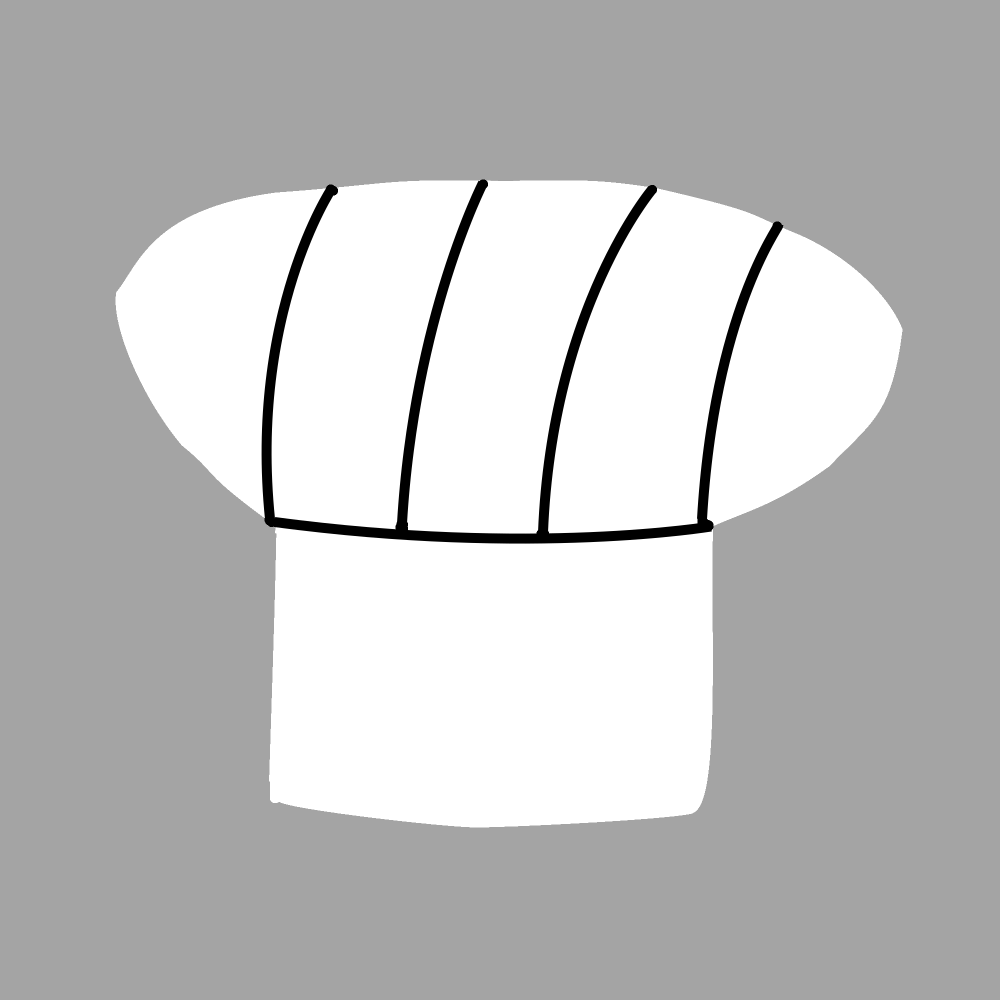

# cookbook
 

Dies ist ein Kochbuch.

## Backwaren

  - [Vanillekipferl](recipes/backwaren/vanillekipferl.md)

## Further Information

* [Changelog](CHANGELOG)
* [License (CC BY 4.0)](LICENSE)
* [Gitlab](https://gitlab.namibsun.net/non-programming/cookbook)]
* [Progstats](https://progstats.namibsun.net/projects/cookbook)